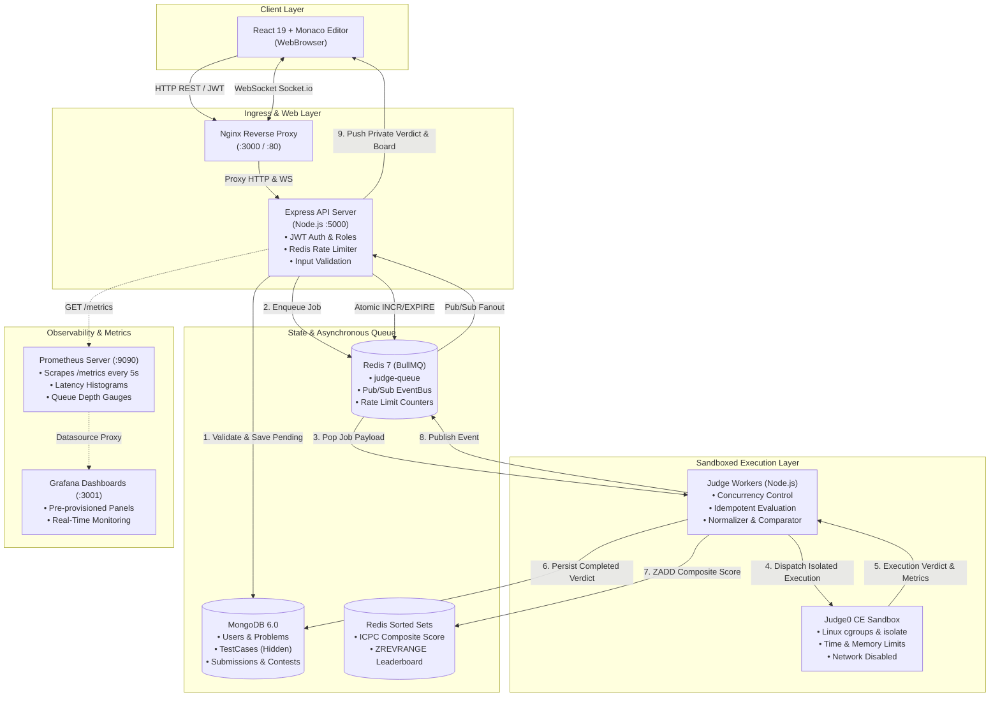

# CodeJudge ⚖️
> **A high-performance, sandboxed online judge platform for real-time collegiate competitive programming contests.**

[](https://github.com/your-org/codejudge/actions/workflows/ci.yml)
[](https://nodejs.org/)
[](https://react.dev/)
[](https://www.docker.com/)
[](https://prometheus.io/)
[](LICENSE)

---

## 1. Problem & Goal

Colleges and universities require an infrastructure to host secure, real-time programming assessments and contests. Evaluating untrusted student source code in multi-tenant environments poses significant security, resource-isolation, and latency challenges:

- **Security Risks**: Arbitrary student code could attempt remote code execution (RCE), fork-bombs, unauthorized network scanning, or accessing backend database credentials.
- **Fairness & Consistency**: Submissions must execute within deterministic CPU time and memory boundaries, with strict output sanitization (normalizing CRLF and trailing spaces).
- **Concurrency & Live Feedback**: During contest starts, hundreds of simultaneous submissions must be buffered into asynchronous queues without degrading the web tier, updating an ICPC-compliant leaderboard via WebSockets with zero race conditions.

**CodeJudge** solves these challenges with a decoupled, asynchronous microservices architecture that isolates untrusted code inside sandboxed execution containers (Judge0 CE), guarantees zero test-case leakage, enforces strict rate limits, and exposes production telemetry via Prometheus and Grafana.

---

## 2. System Architecture

User source code **never** runs on the Express API server or near the MongoDB database. The API server remains completely stateless, offloading evaluation to BullMQ and Redis, where worker pools interface with isolated Judge0 sandbox containers.



---

## 3. Technology Stack

| Layer | Component | Technology | Rationale & Justification |
| :--- | :--- | :--- | :--- |
| **Frontend** | Code Editor & SPA | **React 19 + Monaco Editor + Vite** | High-performance syntax highlighting, multi-language intellisense, client-side draft auto-save. |
| **API Server** | HTTP Gateway | **Node.js 20 + Express** | Non-blocking asynchronous I/O, modular routing, Helmet security headers, CORS protection. |
| **Database** | Persistence Layer | **MongoDB 6.0 (Mongoose)** | Flexible schema for contest configurations, submission history, and hidden test-case storage. |
| **Queue** | Task Queue | **Redis 7 + BullMQ** | Backpressure management, exponential backoff retries, and atomic distributed job coordination. |
| **Sandbox** | Sandboxed Execution | **Judge0 CE (Self-Hosted)** | Kernel-level CPU (`rlimit`), memory, process (`nproc`), and network namespace isolation via Linux `isolate`. |
| **Real-Time** | Live Push | **Socket.io + Redis Pub/Sub** | Room-based verdict streaming to private user channels (`user:<id>`) and live contest updates (`contest:<id>`). |
| **Leaderboard** | Real-Time Ranking | **Redis Sorted Sets (`ZSET`)** | $O(\log N)$ inserts and $O(\log N + M)$ range queries using ICPC composite score encoding. |
| **Rate Limiter** | Abuse Protection | **Redis-Backed Atomic Limiter** | Multi-key atomic `INCR` + `EXPIRE` returning HTTP 429 and `Retry-After` headers. |
| **Monitoring** | Telemetry | **Prometheus + Grafana (`prom-client`)**| Custom histograms, gauges for queue depth, verdict distribution, and auto-provisioned dashboards. |
| **Packaging** | Deployment | **Docker Compose (10 Services)** | Reproducible, isolated environments across dev, CI, and production. |
| **CI** | Pipeline | **GitHub Actions** | Automated linting, multi-phase regression suites, and Docker image validation on every push. |

---

## 4. Setup & Running Locally

### Prerequisites
- Node.js `20.x` or higher
- Docker & Docker Compose (for production deployment)
- Git

### Quickstart with Docker Compose (Recommended)

1. **Clone the repository**:
   ```bash
   git clone https://github.com/your-org/codejudge.git
   cd codejudge
   ```

2. **Copy environment variables**:
   ```bash
   cp .env.example .env
   ```

3. **Boot all 10 microservices**:
   ```bash
   docker compose up -d --build
   ```

4. **Access the platform**:
   - **Frontend Web UI**: [http://localhost:3000](http://localhost:3000)
   - **Backend API & Health**: [http://localhost:5000/health](http://localhost:5000/health)
   - **Prometheus Metrics**: [http://localhost:5000/metrics](http://localhost:5000/metrics)
   - **Prometheus Server**: [http://localhost:9090](http://localhost:9090)
   - **Grafana Dashboards**: [http://localhost:3001](http://localhost:3001) *(Credentials: `admin` / `admin`)*

---

### Local Development Setup (Without Docker)

CodeJudge includes an automatic in-memory fallback layer, allowing development and testing without running local Redis or Docker daemons.

1. **Backend Setup**:
   ```bash
   cd backend
   npm install
   cp .env.example .env
   # Start the Express API server with automatic hot-reload
   npm run dev
   ```

2. **Start the Asynchronous Judge Worker**:
   ```bash
   # In a separate terminal
   cd backend
   npm run worker
   ```

3. **Frontend Setup**:
   ```bash
   cd frontend
   npm install
   cp .env.example .env
   npm run dev
   # Accessible at http://localhost:5173
   ```

4. **Seed Database with Standard Contest Problems**:
   ```bash
   cd backend
   npm run seed
   ```

---

## 5. Security Architecture & Threat Model

CodeJudge is engineered around defensive programming and zero-trust evaluation:

1. **Sandboxed Code Execution**:
   - Compilers and user binaries run inside Judge0 CE containers using Linux namespaces and control groups (`cgroups`).
   - Limits enforced per execution: Time Limit (100ms–10s), Memory Limit (16MB–1024MB), Maximum Process Count (`nproc`), and **disabled network access**.
2. **Hidden Test-Case Isolation**:
   - Test cases flagged with `isHidden: true` are filtered at the MongoDB query layer (`TestCase.find({ isHidden: false })`). Confidential inputs and expected outputs are never loaded into memory during public problem views or sample run executions.
3. **Plagiarism & Competitor Code Concealment**:
   - Competitors cannot view source code belonging to others. `GET /submissions` excludes source code payloads (`.select('-code')`), and `GET /submissions/:id` verifies JWT identity—only the submission author or an administrator can inspect raw code.
4. **Denial-of-Service (DoS) Hardening**:
   - Request bodies are capped at 1 MB; source code size is hard-limited to 64 KB on `/run` and `/submissions`.
   - Redis-backed rate limiters enforce:
     - Authentication (`POST /auth/login`): 5 requests/min per IP
     - Sample Runs (`POST /run`): 10 requests/min per user
     - Submissions (`POST /submissions`): 5 requests/min per user
     - Exceeded requests return HTTP 429 with explicit `Retry-After` headers.
5. **Security Headers**:
   - `helmet` applies strict HTTP headers: `X-Content-Type-Options: nosniff`, `X-Frame-Options: SAMEORIGIN`, and strict CORS policies.

---

## 6. Real-Time Leaderboard & ICPC Penalty Logic

Leaderboard calculations adhere to standard International Collegiate Programming Contest (ICPC) rules:
1. **Primary Sort**: Total number of unique problems solved (higher is better).
2. **Tie-Breaker**: Total penalty time in minutes (lower is better).
   - $\text{Problem Penalty} = \text{Solve Time (mins from contest start)} + (20 \text{ mins} \times \text{Wrong Attempts before AC})$.
   - Attempts submitted *after* the first Accepted verdict do not penalize the score.

### High-Performance Redis Encoding
To deliver $O(\log N)$ updates without performing expensive database table scans, scores are encoded into a 64-bit integer inside a Redis Sorted Set (`ZSET`):

$$\text{Composite Score} = (\text{Problems Solved} \times 10^7) - \text{Total Penalty}$$

Calling `ZREVRANGEBYSCORE` or `ZREVRANGE` retrieves ranked contestants pre-sorted with tie-breakers intact, immediately fanned out to active contestants over Socket.io.

---

## 7. Automated Test Suite & Load Test Results

### Automated Regression Suite (235+ Checks)
The platform is verified by 10 comprehensive automated test suites covering unit logic, integration flows, live WebSockets, concurrency, and security invariants:

```bash
cd backend
npm test               # Phase 1: Auth, Roles, MongoDB Models (22 tests)
npm run test:phase2    # Phase 2: Problems & Test-Case CRUD (22 tests)
npm run test:phase3    # Phase 3: Monaco Run & Output Comparison (21 tests)
npm run test:phase4    # Phase 4: BullMQ Queue & Worker (23 tests)
npm run test:phase5    # Phase 5: Socket.io Live Verdict Streaming (11 tests)
npm run test:phase6    # Phase 6: Contests & Redis Leaderboard (24 tests)
npm run test:phase7    # Phase 7: Rate Limiting & Security Hardening (40 tests)
npm run test:phase8    # Phase 8: Prometheus Metrics & Grafana Audit (23 tests)
npm run test:phase9    # Phase 9: Docker Compose & CI Pipeline (35 tests)
npm run test:concurrency # Phase 10: High-Concurrency Stress Test (14 tests)
npm run test:phase10   # Phase 10: Architecture & Documentation Audit (14 tests)
```

### Empirical Load Test (Autocannon Benchmark)
To simulate the start of a competitive programming contest, an Autocannon load test was executed against `POST /submissions` with 20 concurrent connections sustained over 10 seconds:

```
====================================================
  AUTOCANNON BENCHMARK RESULTS (Measured on System)
====================================================
Total Requests Handled     : 608 submissions
Average Throughput         : 60.8 req/sec
Peak Throughput            : 75.0 req/sec
Latency (p50 - Median)     : 334 ms
Latency (p95 - 95th %ile)  : 488 ms
Latency (p99 - 99th %ile)  : 490 ms
Maximum Request Latency    : 530 ms
Non-2xx / Errors           : 0 errors (100% success rate)
Peak Measured Queue Depth  : 44 jobs buffered
====================================================
```
*Note: Under peak queue buffering (44 concurrent submissions), all jobs were sequentially drained and evaluated by the worker pool with 0 dropped jobs, 0 duplicate leaderboard entries, and 100% verdict persistence.*

---

## 8. Engineering Trade-offs ("What I Chose and Why")

1. **Redis BullMQ vs. Apache Kafka**:
   - *Choice*: Redis BullMQ.
   - *Rationale*: Kafka excels at persistent log streaming at petabyte scale, but introduces massive operational complexity (Zookeeper/KRaft, partition management). BullMQ provides lightweight, memory-fast atomic job lifecycle management (`waiting`, `active`, `completed`, `failed`), exponential backoff retries, and instant queue-depth inspection, ideal for online judge worker dispatching.

2. **Redis Sorted Sets (`ZSET`) vs. SQL/MongoDB Aggregation for Leaderboard**:
   - *Choice*: Redis Sorted Sets with ICPC composite score encoding.
   - *Rationale*: Recalculating a contest leaderboard with thousands of contestants via database aggregation queries (`$group`, `$lookup`, `$sort`) degrades query latency during contest spikes. Redis `ZSET` updates in $O(\log N)$ time and returns the top 100 ranks in $O(M)$ time directly from memory.

3. **Prometheus Pull Scrapes vs. Push-based APM (Datadog/NewRelic)**:
   - *Choice*: Prometheus pull scraping via `/metrics` (`prom-client`).
   - *Rationale*: Pull-based scraping eliminates outbound telemetry traffic spikes and gives the Prometheus monitoring server centralized rate control, while decoupling the microservice containers from external SaaS dependencies.

4. **Multi-Stage Docker Builds vs. Single Stage**:
   - *Choice*: Multi-stage container builds.
   - *Rationale*: Separating the build environment (Node 20, Vite compilers, development headers) from runtime (Alpine Linux, Nginx) reduced production frontend images from ~350 MB to under 25 MB, drastically shrinking attack surface and container cold-start latency.

---

## 9. What I Would Improve Next

1. **gVisor (`runsc`) Container Runtime Hardening**:
   - Replace or augment Judge0's standard Docker isolation with Google's `runsc` (gVisor) OCI runtime. gVisor implements an application kernel in user space, intercepting system calls and ensuring compromised binaries cannot exploit Linux kernel vulnerabilities.
2. **Kubernetes Per-Submission Batch Jobs**:
   - Transition judge workers from a static pool to Kubernetes `Jobs` orchestrated via KEDA (Kubernetes Event-driven Autoscaling) based on `codejudge_queue_depth` to scale worker pods dynamically from zero to hundreds.
3. **Plagiarism Detection Engine**:
   - Integrate an Abstract Syntax Tree (AST) comparison service (using Tree-sitter or Moss-like winnowing algorithms) that computes pairwise similarity matrices across accepted submissions after contest close.
4. **Distributed Redis Sharding**:
   - Shard contest leaderboards across Redis Cluster instances for national-scale competitions supporting $100,000+$ simultaneous participants.
